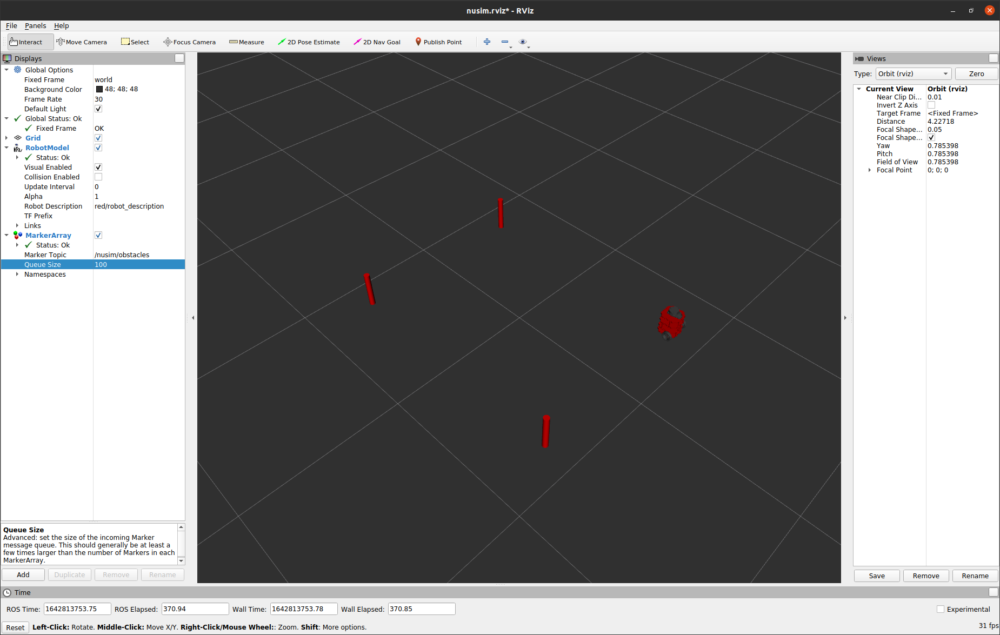

# Nusim  Description
Simulation for testing various slam algorithms

## Launching 
* `roslaunch nusim nusim.launch` to launch rviz with obstacles.
    * You can edit rosparms to change the simualtion. These can be edited in `basic_world.yaml`.
    * Change `x0, y0, and theta0` to set the initial position of the robot. 
    * Under `obstacle` you can set a list of `obs_x` and `obs_y` to set the x,y position of cylinder obstacles for the robot to manuever around. Note: *these list must be the same length or no obstacles will appear*
    * You can control the radius of the obstacles by change `radius` under `obstacle`

## Services
* `rosservice call /nusim/reset "{}"` to reset the simulation. This will restart the sim's clock and return the robot to the initial position
* `rosservice call /nusim/teleport "x: 0.0 y: 0.0 theta: 0.0"` to teleport the robot to a specified x, y, and theta(radians) pose. 

