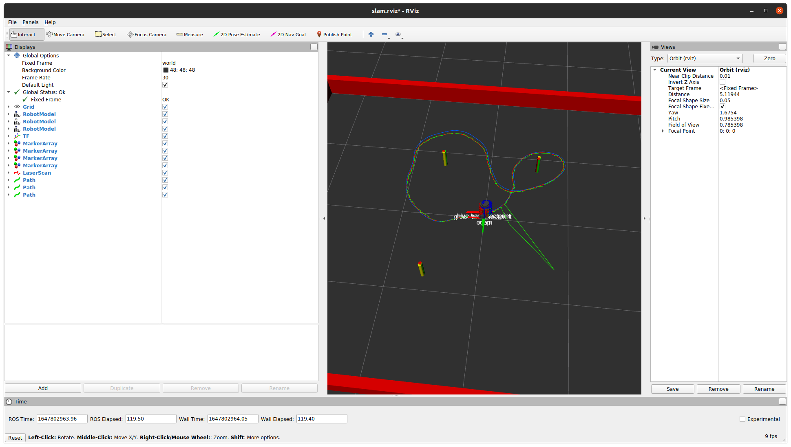

# Nuslam  Description
Simulation for testing various slam algorithms

## Content
### ROS Nodes
- slam.cpp - rosnode for running slam combined with odometry
- landmarks.cpp - rosnode for parsing lidar data and determining landmark locations
### Source files for lib
- cluster.cpp - source file for slam_ml namespace which has utilities for detection and classifying clusters
- ekflib.cpp - source file for EFK_DD namespace which implements extended kalman filter

## Launching 
* `roslaunch nuslam slam.launch`
    * This will launch rviz with the simulated robot(red), pure odometry robot(blue) and the slam robot(green). 
    * Each robot will have a corresponding path for it.
    * The obstacles come in 3 different colors. Red is the simulated location(ground truth), Yellow is what the sensor is picking up, and green is the current location according to slam. 
    * You can add obstacles by editing the `basic_world.yaml` in the nusim package to see how the algorithm reaction. 

An example:

## Services
* `rosservice call /set_pose "x: 0.0 y: 0.0 theta: 0.0"` to teleport the robot to a specified x, y, and theta(radians) pose. 

