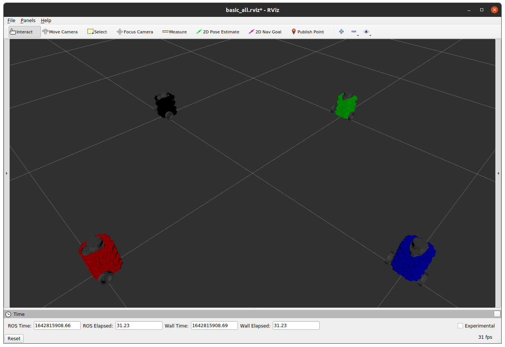

# Nuturtle  Description
URDF files for Nuturtle `deluxe_burger`
* `roslaunch nuturtle_description load.launch` to see the robot in rviz.
    * Use `color` argument to set color as red, blue, green, or black(default).
    * Use `use_jsp:=true` to produce wheels for the robot
* `roslaunch nuturtle_description load_all.launch` to see four different color copies of the robot in rviz.

